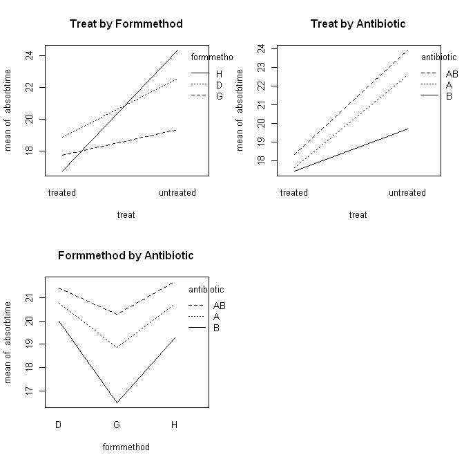
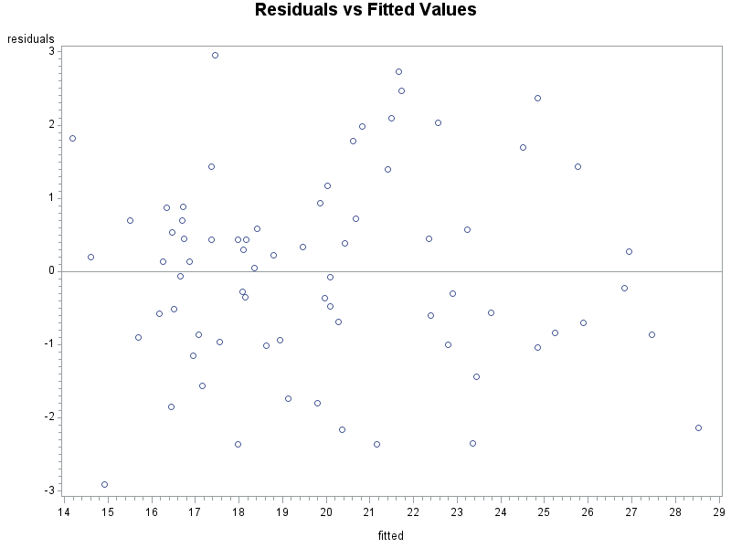
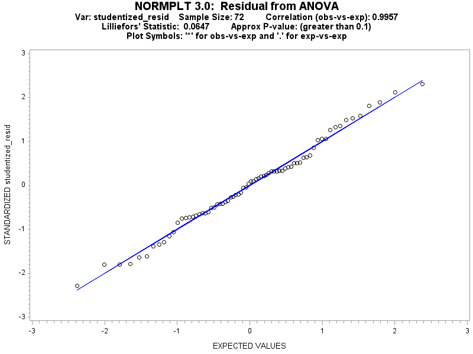
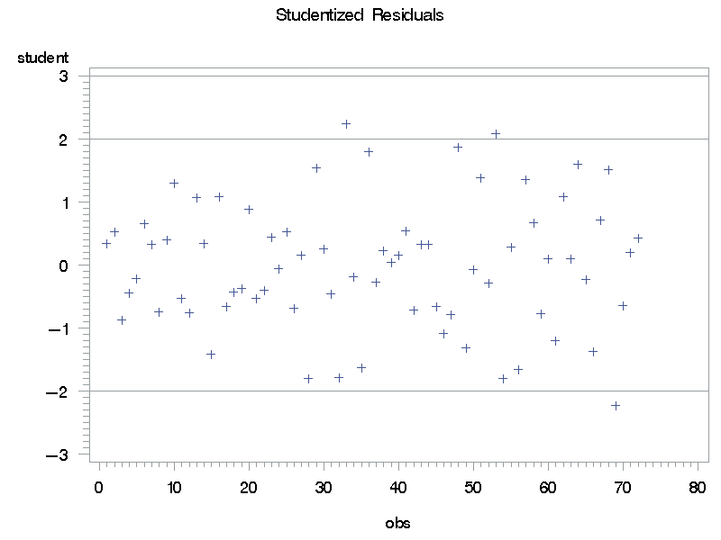

# Antibiotic Capsule ANOVA Split-Plot Design Analysis

## [Problem](http://math.unm.edu/sites/default/files/files/qual-exams/Edit%20Past%20Qualifying%20Exams%20Page%20Past%20Qualifying%20Exams%20-%20Statistics/UNM_Stat_Exam_Qual_takehome_201301.pdf):

&nbsp;&nbsp;&nbsp;&nbsp;&nbsp;&nbsp;This experiment involves the absorption time (minutes) of a particular type of antibiotic capsule. Four vendors (`W`, `X`, `Y`, `Z`) provide the capsule material.  From each vendor’s material, equal amounts are either left untreated or treated; and because of the difficulties of treating many small batches the chemical treatment in a single large batch for each vendor’s material. Next, the material batches are divided into three sub-batches and formed into capsule shells by three methods (`D`, `G`, `H`); each method creates many capsule shells in one run. Finally, an antibiotic combination (`A` alone, `B` alone, or `A` and `B` together) is placed in each capsule shell.  The shells are all stored for a period of three weeks under accelerated aging conditions, then measured. Each shell is placed in a mildly acidic solution until a proxy for absorption is indicated, at which point the time elapsed in minutes is recorded.  Analyze the data, where vendors are random and the other factors are fixed, and draw conclusions. [Data Link](http://www.stat.unm.edu/~erike/exams/UNM_Stat_Exam_Qual_takehome_201301_pr1-DATA_experiment.csv)

## Solution:
&nbsp;&nbsp;&nbsp;&nbsp;&nbsp;&nbsp;

### Materials and Methods
&nbsp;&nbsp;&nbsp;&nbsp;&nbsp;&nbsp;The data appears to be a Split-split-plot design where our blocks are the four companies providing materials (`W`, `Y`, `X`, `Z`), the whole-plot treatments are treated/untreated groups, our subplot treatments are capsule shell formation method at three levels (`D`,`G`,`H`), and our sub-subplot treatments are antibiotic combinations at three levels (`A`, `AB`, `B`). Both SAS and R were used to analyze the data.
### Analysis
&nbsp;&nbsp;&nbsp;&nbsp;&nbsp;&nbsp;Our model looks like:

∶ absorption time; : general mean; , , :Treatment effects for main plots treated material (`Treat`), subplots for formation method (`Form Method`), and sub-subplots for antibiotic combination (`Antibiotic`), respectively; : Vendor block effect; , , : Two-way interactions; , , : The main plot error, the subplot error, and the sub-subplot error, respectively;  : Three-way interaction

&nbsp;&nbsp;&nbsp;&nbsp;&nbsp;&nbsp;Prior to running the model interaction plots are created to get an idea of how things look. Two-way interaction plots can be seen in [**_Plot A1_**](#Plot-A1). Treat by formation method show lower absorption times for treated materials for all formation method levels. The line for formation method `H` does cross the other formation method levels and suggests interaction. The crossing does cause an issue where we now will not know if the treatment is effective or not without considering the formation method. The interaction plot of treatment by antibiotic shows absorption times for the antibiotic `A` and `AB` appear almost parallel, but antibiotic `B` has a slope much lower, so interaction could be possible. Finally, the interaction plot of formation method by antibiotic show lines roughly parallel, so it’s hopeful that interaction is not present. Next, fitting the full model, we initially examine the model assumptions. A look at the residuals versus the fitted values in [**_Plot A2_**](#Plot-A2) shows no dependence on sign or cone shaped pattern, so the assumption of constant error variance appears to be satisfied. A look at the normal plot of the data in [**_Plot A3_**](#Plot-A3) shows that the data fits the normal line very well without heavy tails. The coefficient of correlation between the ordered residuals and there expected values under normality is 0.9957. Based on the normal plot and correlation it appears that the data is normally distributed. Looking at a plot of the studentized residuals in [**_Plot A4_**](#Plot-A4), there are three observations with absolute studentized residuals greater than two that would be considered outliers. All three cases belong to untreated materials, and two of three belong to antibiotic `B`. However, since it’s assumed there was no measurement error while collecting the data, we cannot remove these cases.

&nbsp;&nbsp;&nbsp;&nbsp;&nbsp;&nbsp;The full split-split plot ANOVA table can be seen in [**_Table A5_**](#Table-A5), we can see that the three way interaction term, and the two way interaction term for formation method and antibiotic are not significant. However, the two-way interactions for treatment and formation method, as well as treatment and antibiotic are significant at the 0.05 level. Looking at the main effects, treatments, and antibiotics are significant at the 0.05 level, but the formation method is marginally insignificant with a p-value of 0.0532. Since the interaction term for treatment and formation method was significant we’ll keep the main effects term.

&nbsp;&nbsp;&nbsp;&nbsp;&nbsp;&nbsp;Since the interaction term for treatments and formation method was significant we move on to comparing the subplots for formation method within the whole plots for treatments averaged over all antibiotic levels using Fisher’s Least Significant Difference (LSD) test at the 0.05 level ([**_Table A6_**](#Table-A6)). We find that for the untreated materials absorption times for formation method `G` are no different than those from method `D`, but lower than those for method `H`. Formation method `G` has the lowest absorption times. For the treated materials there was no significant difference found between any of the three different formation methods. From the ANOVA table the interaction of treatments and antibiotics was also significant so we then compare sub-subplots for antibiotics within main plots for treatments using LSD at the 0.05 level ([**_Table A7_**](#Table-A7)). It is revealed that absorption times for the untreated materials with antibiotics `A` and `AB` are not significantly different from one another, but they are different (higher) then antibiotic `B`. This can be seen in the interaction plot in [**_plot A1_**](#Plot-A1). For the treated materials it was found that there is no significant difference in absorption time between any of the three antibiotic levels.

&nbsp;&nbsp;&nbsp;&nbsp;&nbsp;&nbsp;Looking at main plots (`Treat`) within subplot levels (`Form Method`) averaged over all antibiotic combinations ([**_Table A8_**](#Table-A8)) we find that for formation level `H` there is a significant difference in absorption times between treated and untreated materials averaged over all sub-subplot antibiotic levels. Means for treated materials have much lower average absorption times. For both the level `G` and `D` there is not a significant difference between treated and untreated materials. For main plots treatment within the three sub-subplot levels for antibiotic averaged over levels of formation method ([**_Table A9_**](#Table-A9)), we find that for the antibiotic level `B` there is no significant difference between the treated and untreated materials absorption times, but for the other two levels of antibiotic (`A` and `AB`), there is a significant difference between treated and untreated absorption times with treated materials again having lower absorption rates.
### Conclusion
&nbsp;&nbsp;&nbsp;&nbsp;&nbsp;&nbsp;After analyzing the model it appears that there isn’t a simple description of the data due to interaction with the main plot material treatment. It is interesting that when comparing the means within the untreated main plots group, that both the formation methods and antibiotics had significantly different levels within themselves. It’s also interesting that main plot means being compared with the subplot and sub-subplot levels show that the treated materials always have the lower absorption times when comparisons are significant. Comparing means for the treatment main plots within formation methods found that only formation method `H` resulted in different absorption times between treated and untreated materials averaged over antibiotics. Also, comparing main plot treatments within antibiotic combinations averaged over formation methods showed that antibiotic `B` was the only sub-subplot treatment to have significant differences.

### Appendix
#### **_Plot A1_**
#### Interaction Plots

#### **_Plot A2_**

#### **_Plot A3_**

#### **_Plot A4_**

#### **_Table A5_**
<table>
<tr>
<th colspan="6" style="border:solid windowtext 1.0pt">ANOVA for Full Model</th>
</tr>
<tr>
<th style="border:solid windowtext 1.0pt"></th>
<th style="border-bottom:solid windowtext 1.0pt">DF</th>
<th style="border-bottom:solid windowtext 1.0pt">Sum Sq</th>
<th style="border-bottom:solid windowtext 1.0pt">Mean Sq</th>
<th style="border-bottom:solid windowtext 1.0pt">F Value</th>
<th style="border-bottom:solid windowtext 1.0pt;border-right:solid windowtext 1.0pt">Pr(>F)</th>
</tr>
<tr>
<th style="border-left:solid windowtext 1.0pt;border-right:solid windowtext 1.0pt" align="left">Vendor</th>
<td>3</td>
<td>7.777778</td>
<td>2.592593</td>
<td></td>
<td style="border-right:solid windowtext 1.0pt"></td>
</tr>
<tr>
<th style="border-left:solid windowtext 1.0pt;border-right:solid windowtext 1.0pt" align="left">Treat</th>
<td>1</td>
<td>331.1022</td>
<td>331.1022</td>
<td>17.59</td>
<td style="border-right:solid windowtext 1.0pt">0.0247</td>
</tr>
<tr>
<th style="border:solid windowtext 1.0pt;border-top:none" align="left">Error(Treat)</th>
<td style="border-bottom:solid windowtext 1.0pt">3</td>
<td style="border-bottom:solid windowtext 1.0pt">56.47111</td>
<td style="border-bottom:solid windowtext 1.0pt">18.8237</td>
<td style="border-bottom:solid windowtext 1.0pt"></td>
<td style="border-right:solid windowtext 1.0pt;border-bottom:solid windowtext 1.0pt"></td>
</tr>
<tr>
  <th></th>
  <td></td>
  <td></td>
  <td></td>
  <td></td>
  <td></td>
</tr>
<tr>
<th style="border:solid windowtext 1.0pt;border-bottom:none" align="left">Form Method</th>
<td>2</td>
<td>70.33444</td>
<td>35.16722</td>
<td>3.784</td>
<td style="border-right:solid windowtext 1.0pt">0.0532</td>
</tr>
<tr>
<th style="border-left:solid windowtext 1.0pt;border-right:solid windowtext 1.0pt" align="left">Treat*Form Method</th>
<td>2</td>
<td>109.8811</td>
<td>54.94056</td>
<td>5.912</td>
<td style="border-right:solid windowtext 1.0pt">0.0163</td>
</tr>
<tr>
<th style="border:solid windowtext 1.0pt;border-top:none" align="left">Error(Form Method)</th>
<td style="border-bottom:solid windowtext 1.0pt">12</td>
<td style="border-bottom:solid windowtext 1.0pt">111.5178</td>
<td style="border-bottom:solid windowtext 1.0pt">9.293148</td>
<td style="border-bottom:solid windowtext 1.0pt"></td>
<td style="border-bottom:solid windowtext 1.0pt;border-right:solid windowtext 1.0pt"></td>
</tr>
<tr>
  <th></th>
  <td></td>
  <td></td>
  <td></td>
  <td></td>
  <td></td>
</tr>
<tr>
<th style="border-left:solid windowtext 1.0pt;border-right:solid windowtext 1.0pt" align="left">Antibiotic</th>
<td>2</td>
<td>79.09778</td>
<td>39.54889</td>
<td>11.449</td>
<td style="border-right:solid windowtext 1.0pt">0.000142</td>
</tr>
<tr>
<th style="border-left:solid windowtext 1.0pt;border-right:solid windowtext 1.0pt" align="left">Treat*Antibiotic</th>
<td>2</td>
<td>38.13778</td>
<td>19.06889</td>
<td>5.52</td>
<td style="border-right:solid windowtext 1.0pt">0.008108</td>
</tr>
<tr>
<th style="border-left:solid windowtext 1.0pt;border-right:solid windowtext 1.0pt" align="left">Form Method*Antibiotic</th>
<td>4</td>
<td>12.19556</td>
<td>3.048889</td>
<td>0.883</td>
<td style="border-right:solid windowtext 1.0pt">0.484053</td>
</tr>
<tr>
<th style="border-left:solid windowtext 1.0pt;border-right:solid windowtext 1.0pt" align="left">Treat*Form Method*Antibiotic</th>
<td>4</td>
<td>9.388889</td>
<td>2.347222</td>
<td>0.68</td>
<td style="border-right:solid windowtext 1.0pt">0.610667</td>
</tr>
<tr>
<th style="border:solid windowtext 1.0pt;border-top:none" align="left">Error(Antibiotic)</th>
<td style="border-bottom:solid windowtext 1.0pt;border-right">36</td>
<td style="border-bottom:solid windowtext 1.0pt;border-right">124.3533</td>
<td style="border-bottom:solid windowtext 1.0pt;border-right">3.454259</td>
<td style="border-bottom:solid windowtext 1.0pt;border-right"></td>
<td style="border-bottom:solid windowtext 1.0pt;border-right:solid windowtext 1.0pt"></td>
</tr>
<tr>
  <th></th>
  <td></td>
  <td></td>
  <td></td>
  <td></td>
  <td></td>
</tr>
<tr>
<th style="border:solid windowtext 1.0pt" align="left">Total</th>
<td style="border-bottom:solid windowtext 1.0pt">71</td>
<td style="border-bottom:solid windowtext 1.0pt">950.2578</td>
<td style="border-bottom:solid windowtext 1.0pt"></td>
<td style="border-bottom:solid windowtext 1.0pt"></td>
<td style="border-bottom:solid windowtext 1.0pt;border-right:solid windowtext 1.0pt"></td>
</tr>
</table>

#### **_Table A6_**

<table>
<tr><th colspan="4" style="border:solid windowtext 1.0pt">Treat=Treated</th></tr>
<tr><th colspan="4" style="border:solid windowtext 1.0pt">Means with the same letter are not significantly different.</th></tr>
<tr>
<th style="border:solid windowtext 1.0pt">t Grouping</th>
<th style="border:solid windowtext 1.0pt">Mean</th>
<th style="border:solid windowtext 1.0pt">N</th>
<th style="border:solid windowtext 1.0pt">Form Method</th>
</tr>
<tr>
<th style="border-left:solid windowtext 1.0pt;border-right:solid windowtext 1.0pt">A</th>
<td>18.9</td>
<td>12</td>
<td style="border-right:solid windowtext 1.0pt">D</td>
</tr>
<tr>
<th style="border-left:solid windowtext 1.0pt;border-right:solid windowtext 1.0pt">A</th>
<td></td>
<td></td>
<td style="border-right:solid windowtext 1.0pt"></td>
</tr>
<tr>
<th style="border-left:solid windowtext 1.0pt;border-right:solid windowtext 1.0pt">A</th>
<td>17.7333</td>
<td>12</td>
<td style="border-right:solid windowtext 1.0pt">G</td>
</tr>
<tr>
<th style="border-left:solid windowtext 1.0pt;border-right:solid windowtext 1.0pt">A</th>
<td></td>
<td></td>
<td style="border-right:solid windowtext 1.0pt"></td>
</tr>
<tr>
<th style="border:solid windowtext 1.0pt;border-top:none">A</th>
<td style="border-bottom:solid windowtext 1.0pt">16.7667</td>
<td style="border-bottom:solid windowtext 1.0pt">12</td>
<td style="border-right:solid windowtext 1.0pt;border-bottom:solid windowtext 1.0pt">H</td>
</tr>
</table>

<table>
<tr><th colspan="5" style="border:solid windowtext 1.0pt">Treat=Untreated</th></tr>
<tr><th colspan="5" style="border:solid windowtext 1.0pt">Means with the same letter are not significantly different.</th></tr>
<tr>
<th style="border:solid windowtext 1.0pt" colspan="2">t Grouping</th>
<th style="border:solid windowtext 1.0pt">Mean</th>
<th style="border:solid windowtext 1.0pt">N</th>
<th style="border:solid windowtext 1.0pt">Form Method</th>
</tr>
<tr>
<th style="border-left:solid windowtext 1.0pt"></th>
<th style="border-right:solid windowtext 1.0pt">A</th>
<td>24.35</td>
<td>12</td>
<td style="border-right:solid windowtext 1.0pt">H</td>
</tr>
<tr>
<th style="border-left:solid windowtext 1.0pt"></th>
<th style="border-right:solid windowtext 1.0pt">A</th>
<td></td>
<td></td>
<td style="border-right:solid windowtext 1.0pt"></td>
</tr>
<tr>
<th style="border-left:solid windowtext 1.0pt">B</th>
<th style="border-right:solid windowtext 1.0pt">A</th>
<td>22.55</td>
<td>12</td>
<td style="border-right:solid windowtext 1.0pt">D</td>
</tr>
<tr>
<th style="border-left:solid windowtext 1.0pt">B</th>
<th style="border-right:solid windowtext 1.0pt"></th>
<td></td>
<td></td>
<td style="border-right:solid windowtext 1.0pt"></td>
</tr>
<tr>
<th style="border:solid windowtext 1.0pt;border-top:none;border-right:none">B</th>
<th style="border-bottom:solid windowtext 1.0pt;border-right:solid windowtext 1.0pt"></th>
<td style="border-bottom:solid windowtext 1.0pt">19.37</td>
<td style="border-bottom:solid windowtext 1.0pt">12</td>
<td style="border-right:solid windowtext 1.0pt;border-bottom:solid windowtext 1.0pt">G</td>
</tr>
</table>

#### **_Table A7_**

<table>
<tr><th colspan="4" style="border:solid windowtext 1.0pt">Treat=Treated</th></tr>
<tr><th colspan="4" style="border:solid windowtext 1.0pt">Means with the same letter are not significantly different.</th></tr>
<tr>
<th style="border:solid windowtext 1.0pt">t Grouping</th>
<th style="border:solid windowtext 1.0pt">Mean</th>
<th style="border:solid windowtext 1.0pt">N</th>
<th style="border:solid windowtext 1.0pt">Antibiotic</th>
</tr>
<tr>
<th style="border-left:solid windowtext 1.0pt;border-right:solid windowtext 1.0pt">A</th>
<td>18.3167</td>
<td>12</td>
<td style="border-right:solid windowtext 1.0pt">AB</td>
</tr>
<tr>
<th style="border-left:solid windowtext 1.0pt;border-right:solid windowtext 1.0pt">A</th>
<td></td>
<td></td>
<td style="border-right:solid windowtext 1.0pt"></td>
</tr>
<tr>
<th style="border-left:solid windowtext 1.0pt;border-right:solid windowtext 1.0pt">A</th>
<td>17.6333</td>
<td>12</td>
<td style="border-right:solid windowtext 1.0pt">A</td>
</tr>
<tr>
<th style="border-left:solid windowtext 1.0pt;border-right:solid windowtext 1.0pt">A</th>
<td></td>
<td></td>
<td style="border-right:solid windowtext 1.0pt"></td>
</tr>
<tr>
<th style="border:solid windowtext 1.0pt;border-top:none">A</th>
<td style="border-bottom:solid windowtext 1.0pt">17.45</td>
<td style="border-bottom:solid windowtext 1.0pt">12</td>
<td style="border-right:solid windowtext 1.0pt;border-bottom:solid windowtext 1.0pt">B</td>
</tr>
</table>

<table>
<tr><th colspan="4" style="border:solid windowtext 1.0pt">Treat=Untreated</th></tr>
<tr><th colspan="4" style="border:solid windowtext 1.0pt">Means with the same letter are not significantly different.</th></tr>
<tr>
<th style="border:solid windowtext 1.0pt">t Grouping</th>
<th style="border:solid windowtext 1.0pt">Mean</th>
<th style="border:solid windowtext 1.0pt">N</th>
<th style="border:solid windowtext 1.0pt">Antibiotic</th>
</tr>
<tr>
<th style="border-left:solid windowtext 1.0pt;border-right:solid windowtext 1.0pt">A</th>
<td>23.95</td>
<td>12</td>
<td style="border-right:solid windowtext 1.0pt">AB</td>
</tr>
<tr>
<th style="border-left:solid windowtext 1.0pt;border-right:solid windowtext 1.0pt">A</th>
<td></td>
<td></td>
<td style="border-right:solid windowtext 1.0pt"></td>
</tr>
<tr>
<th style="border-left:solid windowtext 1.0pt;border-right:solid windowtext 1.0pt">A</th>
<td>22.6</td>
<td>12</td>
<td style="border-right:solid windowtext 1.0pt">A</td>
</tr>
<tr>
<th style="border-left:solid windowtext 1.0pt;border-right:solid windowtext 1.0pt">&nbsp</th>
<td></td>
<td></td>
<td style="border-right:solid windowtext 1.0pt"></td>
</tr>
<tr>
<th style="border:solid windowtext 1.0pt;border-top:none">B</th>
<td style="border-bottom:solid windowtext 1.0pt">19.717</td>
<td style="border-bottom:solid windowtext 1.0pt">12</td>
<td style="border-right:solid windowtext 1.0pt;border-bottom:solid windowtext 1.0pt">B</td>
</tr>
</table>

#### **_Table A8_**

<table>
<tr><th colspan="4" style="border:solid windowtext 1.0pt">Form Method=H</th></tr>
<tr><th colspan="4" style="border:solid windowtext 1.0pt">Means with the same letter are not significantly different.</th></tr>
<tr>
<th style="border:solid windowtext 1.0pt">t Grouping</th>
<th style="border:solid windowtext 1.0pt">Mean</th>
<th style="border:solid windowtext 1.0pt">N</th>
<th style="border:solid windowtext 1.0pt">Treat</th>
</tr>
<tr>
<th style="border-left:solid windowtext 1.0pt;border-right:solid windowtext 1.0pt">A</th>
<td>24.35</td>
<td>12</td>
<td style="border-right:solid windowtext 1.0pt">Untreated</td>
</tr>
<tr>
<th style="border-left:solid windowtext 1.0pt;border-right:solid windowtext 1.0pt">&nbsp</th>
<td></td>
<td></td>
<td style="border-right:solid windowtext 1.0pt"></td>
</tr>
<tr>
<th style="border:solid windowtext 1.0pt;border-top:none">B</th>
<td style="border-bottom:solid windowtext 1.0pt">16.77</td>
<td style="border-bottom:solid windowtext 1.0pt">12</td>
<td style="border-right:solid windowtext 1.0pt;border-bottom:solid windowtext 1.0pt">Treated</td>
</tr>
</table>

<table>
<tr><th colspan="4" style="border:solid windowtext 1.0pt">Form Method=G</th></tr>
<tr><th colspan="4" style="border:solid windowtext 1.0pt">Means with the same letter are not significantly different.</th></tr>
<tr>
<th style="border:solid windowtext 1.0pt">t Grouping</th>
<th style="border:solid windowtext 1.0pt">Mean</th>
<th style="border:solid windowtext 1.0pt">N</th>
<th style="border:solid windowtext 1.0pt">Treat</th>
</tr>
<tr>
<th style="border-left:solid windowtext 1.0pt;border-right:solid windowtext 1.0pt">A</th>
<td>19.37</td>
<td>12</td>
<td style="border-right:solid windowtext 1.0pt">Untreated</td>
</tr>
<tr>
<th style="border-left:solid windowtext 1.0pt;border-right:solid windowtext 1.0pt">A</th>
<td></td>
<td></td>
<td style="border-right:solid windowtext 1.0pt"></td>
</tr>
<tr>
<th style="border:solid windowtext 1.0pt;border-top:none">A</th>
<td style="border-bottom:solid windowtext 1.0pt">17.73</td>
<td style="border-bottom:solid windowtext 1.0pt">12</td>
<td style="border-right:solid windowtext 1.0pt;border-bottom:solid windowtext 1.0pt">Treated</td>
</tr>
</table>

<table>
<tr><th colspan="4" style="border:solid windowtext 1.0pt">Form Method=D</th></tr>
<tr><th colspan="4" style="border:solid windowtext 1.0pt">Means with the same letter are not significantly different.</th></tr>
<tr>
<th style="border:solid windowtext 1.0pt">t Grouping</th>
<th style="border:solid windowtext 1.0pt">Mean</th>
<th style="border:solid windowtext 1.0pt">N</th>
<th style="border:solid windowtext 1.0pt">Treat</th>
</tr>
<tr>
<th style="border-left:solid windowtext 1.0pt;border-right:solid windowtext 1.0pt">A</th>
<td>22.55</td>
<td>12</td>
<td style="border-right:solid windowtext 1.0pt">Untreated</td>
</tr>
<tr>
<th style="border-left:solid windowtext 1.0pt;border-right:solid windowtext 1.0pt">A</th>
<td></td>
<td></td>
<td style="border-right:solid windowtext 1.0pt"></td>
</tr>
<tr>
<th style="border:solid windowtext 1.0pt;border-top:none">A</th>
<td style="border-bottom:solid windowtext 1.0pt">18.90</td>
<td style="border-bottom:solid windowtext 1.0pt">12</td>
<td style="border-right:solid windowtext 1.0pt;border-bottom:solid windowtext 1.0pt">Treated</td>
</tr>
</table>

#### **_Table A9_**

<table>
<tr><th colspan="4" style="border:solid windowtext 1.0pt">Antibiotic=A</th></tr>
<tr><th colspan="4" style="border:solid windowtext 1.0pt">Means with the same letter are not significantly different.</th></tr>
<tr>
<th style="border:solid windowtext 1.0pt">t Grouping</th>
<th style="border:solid windowtext 1.0pt">Mean</th>
<th style="border:solid windowtext 1.0pt">N</th>
<th style="border:solid windowtext 1.0pt">Treat</th>
</tr>
<tr>
<th style="border-left:solid windowtext 1.0pt;border-right:solid windowtext 1.0pt">A</th>
<td>22.6</td>
<td>12</td>
<td style="border-right:solid windowtext 1.0pt">Untreated</td>
</tr>
<tr>
<th style="border-left:solid windowtext 1.0pt;border-right:solid windowtext 1.0pt">&nbsp</th>
<td></td>
<td></td>
<td style="border-right:solid windowtext 1.0pt"></td>
</tr>
<tr>
<th style="border:solid windowtext 1.0pt;border-top:none">B</th>
<td style="border-bottom:solid windowtext 1.0pt">17.63</td>
<td style="border-bottom:solid windowtext 1.0pt">12</td>
<td style="border-right:solid windowtext 1.0pt;border-bottom:solid windowtext 1.0pt">Treated</td>
</tr>
</table>

<table>
<tr><th colspan="4" style="border:solid windowtext 1.0pt">Antibiotic=AB</th></tr>
<tr><th colspan="4" style="border:solid windowtext 1.0pt">Means with the same letter are not significantly different.</th></tr>
<tr>
<th style="border:solid windowtext 1.0pt">t Grouping</th>
<th style="border:solid windowtext 1.0pt">Mean</th>
<th style="border:solid windowtext 1.0pt">N</th>
<th style="border:solid windowtext 1.0pt">Treat</th>
</tr>
<tr>
<th style="border-left:solid windowtext 1.0pt;border-right:solid windowtext 1.0pt">A</th>
<td>23.95</td>
<td>12</td>
<td style="border-right:solid windowtext 1.0pt">Untreated</td>
</tr>
<tr>
<th style="border-left:solid windowtext 1.0pt;border-right:solid windowtext 1.0pt">&nbsp</th>
<td></td>
<td></td>
<td style="border-right:solid windowtext 1.0pt"></td>
</tr>
<tr>
<th style="border:solid windowtext 1.0pt;border-top:none">B</th>
<td style="border-bottom:solid windowtext 1.0pt">18.317</td>
<td style="border-bottom:solid windowtext 1.0pt">12</td>
<td style="border-right:solid windowtext 1.0pt;border-bottom:solid windowtext 1.0pt">Treated</td>
</tr>
</table>

<table>
<tr><th colspan="4" style="border:solid windowtext 1.0pt">Antibiotic=B</th></tr>
<tr><th colspan="4" style="border:solid windowtext 1.0pt">Means with the same letter are not significantly different.</th></tr>
<tr>
<th style="border:solid windowtext 1.0pt">t Grouping</th>
<th style="border:solid windowtext 1.0pt">Mean</th>
<th style="border:solid windowtext 1.0pt">N</th>
<th style="border:solid windowtext 1.0pt">Treat</th>
</tr>
<tr>
<th style="border-left:solid windowtext 1.0pt;border-right:solid windowtext 1.0pt">A</th>
<td>19.72</td>
<td>12</td>
<td style="border-right:solid windowtext 1.0pt">Untreated</td>
</tr>
<tr>
<th style="border-left:solid windowtext 1.0pt;border-right:solid windowtext 1.0pt">A</th>
<td></td>
<td></td>
<td style="border-right:solid windowtext 1.0pt"></td>
</tr>
<tr>
<th style="border:solid windowtext 1.0pt;border-top:none">A</th>
<td style="border-bottom:solid windowtext 1.0pt">17.45</td>
<td style="border-bottom:solid windowtext 1.0pt">12</td>
<td style="border-right:solid windowtext 1.0pt;border-bottom:solid windowtext 1.0pt">Treated</td>
</tr>
</table>
